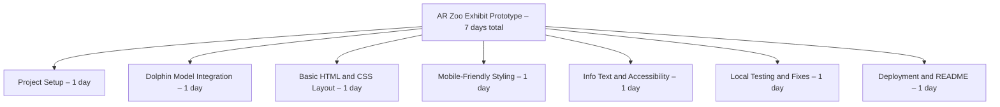

# AR Zoo Exhibit – La Plata Dolphin

A lightweight prototype of an Augmented Reality (AR) Zoo Exhibit, featuring the **La Plata Dolphin** (Pontoporia blainvillei).  
Part of a project aimed at raising awareness for endangered species.

---

## Project Structure

```
/assets
  /models
    dolphin.glb   ← 3D model of the dolphin
  /images
    (optional: screenshots, UI images)
index.html         ← Main page
style.css          ← Stylesheet
```

---

## Work Breakdown Structure (WBS)



---

## Running Locally (for testing)

To view the project on your computer:

1. Open a terminal inside the project folder.
2. Run the following command:
   ```bash
   python -m http.server 8000
   ```
3. Open your browser and navigate to:
   ```
   http://localhost:8000
   ```

The AR experience should load successfully.

---

## Hosting the Project (Netlify)

You can make your project public and share it with anyone:

1. Go to [https://app.netlify.com/](https://app.netlify.com/).
2. Create a free account.
3. Click **"Add new site"** → **"Deploy manually"**.
4. **Drag and drop your project folder** (the one with `index.html` inside).

Netlify will automatically deploy the site and give you a public link!

---

## Important Notes

- All assets must use **relative paths** like:
  ```html
  src="./assets/models/dolphin.glb"
  ```
- No build tools are required (no npm, Parcel, Vite, etc).
- Works on any modern browser supporting `<model-viewer>`.
- Optional: for AR functionality on mobile, make sure your `.glb` model has AR-compatible metadata.

---

## Future Features (planned)

- Support for QR code scanning at exhibit locations.
- Interactive educational panels.
- Multiple animals and environments.
- Animation improvements (dolphin swimming movement).

---

# Credits

Built using:
- [Model-Viewer](https://modelviewer.dev/)
- [Python HTTP server](https://docs.python.org/3/library/http.server.html)

---

# License

This project is for educational and awareness purposes.  
Feel free to fork and expand it!

---
