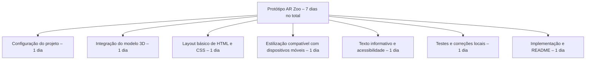

# Protótipo de exposição AR – Toninha

Um protótipo estudantil em pequena escala que explora como a Realidade Aumentada (AR) pode ser usada em exposições educacionais para aumentar a conscientização sobre espécies criticamente ameaçadas de extinção, como a **toninha (Pontoporia blainvillei)**.

Clique no botão abaixo para ver o protótipo implantado no Netlify:

[](https://ar-zoo-exhibit.netlify.app/)


---

## Visão Geral

Essa experiência de AR foi projetada para ser exibida em museus, escolas ou campanhas de conscientização. Os usuários podem girar, aplicar zoom e explorar um modelo 3D da toninha e acessar informações básicas sobre seu status de ameaça de extinção. Futuras expansões podem incluir exposições de várias espécies, interatividade e cenas acionadas por código QR.

---

## Funcionalidades

- Layout HTML/CSS simples e compatível com dispositivos móveis  
- Modelo `.glb` incorporado com controles de câmera  
- Rotação automática e modo AR ativados  
- Leve, sem necessidade de frameworks  
- Implantável no [Netlify](https://netlify.com)

---

## Estrutura da Pasta

```
/assets
  /images
    dolphin-preview.gif
  /models
    dolphin.glb
README.md
index.html
style.css
```

---

## Ferramentas utilizadas

- [Model-Viewer by Google](https://modelviewer.dev/)
- HTML5 / CSS3
- Python para hospedagem local
- Netlify

---

## Testando localmente

1. Baixe este repositório e extraia o conteúdo.
2. Abra o terminal de comando na pasta e execute:

```bash
python -m http.server
```

3. Abra o seguinte endereço no navegador:
```bash
http://localhost:8000
```

---

## Estrutura Analítica do Projeto (WBS)



---

## Funcionalidades futuras (Planejadas)

- [ ] Adicionar cenas de AR de outras espécies difíceis de serem observadas em seu habitat natural.  
- [ ] Cenas acionadas por códio QR em locais selecionados.  
- [ ] Narração em áudio e hotspots de informação interativos  
- [ ] Alternância de idiomas (português/inglês)  
- [ ] Reprodução de animações para os modelos 3D 

---

## Sobre a toninha

A toninha (Pontoporia blainvillei), também chamada de boto-cachimbo ou franciscana é uma espécie de golfinho fluvial que habita as águas costeiras do Brasil, Uruguai e Argentina e está em **perigo de extinção**. Entre as ameaças que enfrenta estão a captura acidental em redes de pesca, a pesca excessiva de suas presas e a poluição.

---

## Licença & Créditos

- Modelo 3D usado apenas para fins educacionais  
- Criado por William Borges como parte de um trabalho escolar  
- [Model-Viewer](https://github.com/google/model-viewer) sob Apache License 2.0

---

