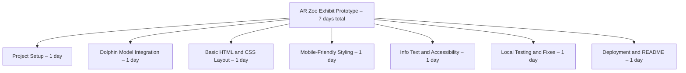

[](README.md)
[](README.pt-br.md)

# AR Exhibit Prototype - La Plata Dolphin

A small-scale student prototype exploring how Augmented Reality (AR) can be used in educational exhibits to raise awareness of critically endangered species like the **La Plata dolphin (Pontoporia blainvillei)**.

[](https://ar-zoo-exhibit.netlify.app)

<br/>

 

---

## Overview

This AR experience is designed to be displayed in museums, schools, or awareness campaigns. Users can rotate, zoom, and explore a 3D model of the dolphin and access basic information about its endangered status. Future expansions may include multiple animal exhibits, interactivity, and QR-code-triggered scenes.

---

## Features

- Simple, mobile-friendly HTML/CSS layout  
- Embedded `.glb` model with camera controls  
- Auto-rotation and AR mode enabled  
- Lightweight, no frameworks required  
- Fully deployable on [Netlify](https://netlify.com)

---

## Folder Structure

```
/assets
  /models
    dolphin.glb
README.md
README.pt-br.md
index.html
style.css
```

---

## Tech Used

- [Model-Viewer by Google](https://modelviewer.dev/)
- HTML5 / CSS3
- Local or Netlify hosting

---

## Local Testing

To test locally with proper file access:

```bash
# Python 3.x
python -m http.server
```

Then open:
```bash
http://localhost:8000
```

*Desktop browsers won’t show the AR button, AR features are only available on mobile browsers like Chrome on Android or Safari on iOS.

---

## Work Breakdown Structure (WBS)



---

## Future Features (Planned)

- [ ] Add AR scenes of other endangered species that are difficult to observe in their natural habitats
- [ ] QR code-triggered exhibits for selected physical locations  
- [ ] Audio narration and interactive info hotspots  
- [ ] Language toggle (Portuguese/English)  
- [ ] Animation playback for 3D models  

---

## About the La Plata Dolphin

The La Plata dolphin (Pontoporia blainvillei) is an **endangered** marine mammal found along the coasts of Brazil, Uruguay and Argentina. It faces threats from fishing nets (bycatch), habitat loss, and pollution.

---

## License & Credits

- 3D model used for educational purposes only  
- Built by William Borges as part of a school project  
- [Model-Viewer](https://github.com/google/model-viewer) under Apache License 2.0

---
