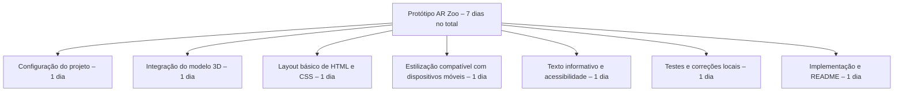

[](README.md)
[](README.pt-br.md)

# Protótipo de Exposição AR – Toninha

Protótipo estudantil em pequena escala que explora como a Realidade Aumentada (AR) pode ser usada em exposições educacionais para aumentar a conscientização sobre espécies criticamente ameaçadas de extinção, como a **toninha (Pontoporia blainvillei)**.

Clique no botão abaixo para ver o protótipo implementado no Netlify (as funcionalidades de AR estão disponíveis apenas para dispositivos móveis):

[](https://ar-zoo-exhibit.netlify.app/)

<br/>

 

---

## Visão Geral

Essa experiência de AR foi projetada para ser exibida em museus, escolas ou campanhas de conscientização. Os usuários podem girar, aplicar zoom e explorar um modelo 3D da toninha e acessar informações básicas sobre seu status de ameaça de extinção. Futuras expansões podem incluir exposições de várias espécies, interatividade e cenas acionadas por código QR.

---

## Funcionalidades

- Layout HTML/CSS simples e otimizado para dispositivos móveis  
- Modelo `.glb` incorporado com controles de câmera  
- Rotação automática e modo AR ativados  
- Leve, sem necessidade de frameworks  
- Implementável no [Netlify](https://netlify.com)

---

## Estrutura da pasta

```
/assets
  /images
    dolphin-preview.gif
  /models
    dolphin.glb
README.md
README.pt-br.md
index.html
style.css
```

---

## Tecnologia utilizada

- [Model-Viewer do Google](https://modelviewer.dev/)
- HTML5 / CSS3
- Hospedagem local ou Netlify

---

## Teste local

Para testar localmente com acesso adequado ao arquivo:

```bash
# Python 3.x
python -m http.server
```

Depois abra:
```bash
http://localhost:8000
```

*Navegadores de desktop não mostrarão o botão AR, as funcionalidades de AR estão disponíveis apenas em navegadores para dispositivos móveis como o Chrome no Android ou o Safari no iOS.

---

## Estrutura Analítica do Projeto (WBS)



---

## Funcionalidades futuras (planejadas)

- [ ] Adicionar cenas de AR de outras espécies ameaçadas que sejam difíceis de serem observadas em seu habitat natural.  
- [ ] Exposições acionadas por código QR em locais físicos selecionados.  
- [ ] Narração em áudio e hotspots de informação interativos.  
- [ ] Alternância de idiomas (português/inglês).  
- [ ] Reprodução de animações para os modelos 3D. 

---

## Sobre a toninha

A toninha (Pontoporia blainvillei) é um mamífero marinho **em perigo de extinção** que habita as águas costeiras do Brasil, Uruguai e Argentina. Ela enfrenta ameaças como redes de pesca (captura acidental), perda de habitat e poluição.

---

## Licença & Créditos

- Modelo 3D usado apenas para fins educacionais  
- Criado por William Borges como parte de um trabalho escolar  
- [Model-Viewer](https://github.com/google/model-viewer) sob Apache License 2.0

---

